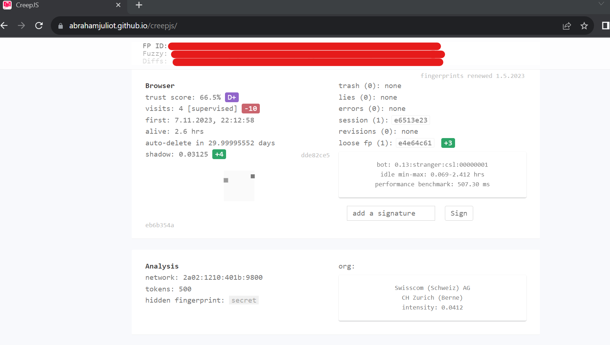

# 🎭 [Playwright](https://playwright.dev) for Python 
[](https://pypi.python.org/pypi/playwright/)

This is a patch of the original playwright implementation for Python.

|          | Linux | macOS | Windows |
|   :---   | :---: | :---: | :---:   |
| Chromium <!-- GEN:chromium-version -->120.0.6099.28<!-- GEN:stop --> | ✅ | ✅ | ✅ |
| WebKit <!-- GEN:webkit-version -->17.4<!-- GEN:stop --> | ✅ | ✅ | ✅ |
| Firefox <!-- GEN:firefox-version -->119.0<!-- GEN:stop --> | ✅ | ✅ | ✅ |
Warnings: 
* the **Only chromium** part for Playwright is patched.
* This will overwrite your default playwright package.

Note: For testing with Playwright and undetected-playwright, use multiple venv's

## Demos (tested on Win 10)




## Dependencies

* Google-Chrome installed (`channel="chrome"` recommended)

## Installation

You don't want to clone & build the whole repo? Try using the script at [Patch native playwright](#Patch-native-playwright)

Run in the shell:
```
git clone https://github.com/kaliiiiiiiiii/undetected-playwright-python
cd undetected-playwright-python
python -m pip install -r local-requirements.txt
python build_patched.py
```

[//]: # (run `pip install undetected-playwright-python` in your terminal)

## Example

```python
import asyncio

# undetected-playwright here!
from playwright.async_api import async_playwright, Playwright


async def run(playwright: Playwright):
    args = []
    args.append("--disable-blink-features=AutomationControlled")
    browser = await playwright.chromium.launch(channel="chrome", headless=False,
                                               args=args)
    page = await browser.new_page()
    await page.goto("https://nowsecure.nl/#relax")
    input("Press ENTER to continue to Creep-JS:")
    await page.goto("https://nowsecure.nl/#relax")
    await page.goto("https://abrahamjuliot.github.io/creepjs/")
    input("Press ENTER to exit:")
    await browser.close()


async def main():
    async with async_playwright() as playwright:
        await run(playwright)


if __name__ == "__main__":
    loop = asyncio.ProactorEventLoop()
    loop.run_until_complete(main())
    # asyncio.run(main) # should work for non-Windows as well
```

```py

# undetected-playwright here!
from playwright.sync_api import sync_playwright


with sync_playwright() as p:
    args = []
    args.append("--disable-blink-features=AutomationControlled")
    browser = p.chromium.launch(args=args, headless=False, channel="chrome")
    page = browser.new_page()
    page.goto("https://nowsecure.nl/#relax")
    input("Press ENTER to continue to Creep-JS:")
    page.goto("https://nowsecure.nl/#relax")
    page.goto("https://abrahamjuliot.github.io/creepjs/")
    input("Press ENTER to exit:")
    browser.close()
```

## Patch native playwright
Warning: \
**Running** this **multiple times breaks playwright**, be aware!

<details>
<summary>Python Code (Click to expand)</summary>

```python
import re
import os
import playwright

def patch_driver(path: str):
    # patch driver
    print(f'[PATCH] patching driver for "{path}"', file=sys.stderr)

    def replace(path: str, old_str: str, new_str: str):
        with open(path, "r") as f:
            content = f.read()
            content = content.replace(old_str, new_str)
        with open(path, "w") as f:
            f.write(content)

    server_path = path + "/package/lib/server"
    chromium_path = server_path + "/chromium"

    # comment out all "Runtime.enable" occurences
    cr_devtools_path = chromium_path + "/crDevTools.js"
    replace(cr_devtools_path, "session.send('Runtime.enable')", "/*session.send('Runtime.enable'), */")

    cr_page_path = chromium_path + "/crPage.js"
    with open(cr_page_path, "r") as f:
        cr_page = f.read()
        cr_page = cr_page.replace("this._client.send('Runtime.enable', {}),",
                                  "/*this._client.send('Runtime.enable', {}),*/")
        cr_page = cr_page.replace("session._sendMayFail('Runtime.enable');",
                                  "/*session._sendMayFail('Runtime.enable');*/")
    with open(cr_page_path, "w") as f:
        f.write(cr_page)

    cr_sv_worker_path = chromium_path + "/crServiceWorker.js"
    replace(cr_sv_worker_path, "session.send('Runtime.enable', {}).catch(e => {});",
            "/*session.send('Runtime.enable', {}).catch(e => {});*/")

    # patch ExecutionContext eval to still work
    frames_path = server_path + "/frames.js"

    _context_re = re.compile(r".*\s_context?\s*\(world\)\s*\{(?:[^}{]+|\{(?:[^}{]+|\{[^}{]*\})*\})*\}")
    _context_replacement = \
        " async _context(world) {\n" \
        """
        // atm ignores world_name
        if (this._isolatedContext == undefined) {
          var worldName = "utility"
          var result = await this._page._delegate._mainFrameSession._client.send('Page.createIsolatedWorld', {
            frameId: this._id,
            grantUniveralAccess: true,
            worldName: worldName
          });
          var crContext = new _crExecutionContext.CRExecutionContext(this._page._delegate._mainFrameSession._client, {id:result.executionContextId})
          this._isolatedContext = new _dom.FrameExecutionContext(crContext, this, worldName)
        }
        return this._isolatedContext
        \n""" \
        "}"
    clear_re = re.compile(
        r".\s_onClearLifecycle?\s*\(\)\s*\{")
    clear_repl = \
        " _onClearLifecycle() {\n" \
        """
        this._isolatedContext = undefined;
        """

    with open(frames_path, "r") as f:
        frames_js = f.read()
        frames_js = "// undetected-playwright-patch - custom imports\n" \
                    "var _crExecutionContext = require('./chromium/crExecutionContext')\n" \
                    "var _dom =  require('./dom')\n" \
                    + "\n" + frames_js

        # patch _context function
        frames_js = _context_re.subn(_context_replacement, frames_js, count=1)[0]
        frames_js = clear_re.subn(clear_repl, frames_js, count=1)[0]

    with open(frames_path, "w") as f:
        f.write(frames_js)

driver_module_path = os.path.dirname(playwright.__file__) + "/driver"
patch_driver(driver_module_path)
```
</details>

## Documentation

See the original
[https://playwright.dev/python/docs/intro](https://playwright.dev/python/docs/intro)

## API Reference

[https://playwright.dev/python/docs/api/class-playwright](https://playwright.dev/python/docs/api/class-playwright)


## Patches
- [ ] [`Runtime.enable`](https://chromedevtools.github.io/devtools-protocol/tot/Runtime/#method-enable)
  - [x] remove Runtime.enable occurences
  - [x] patch _context(world) getter
    - [x] isolatedWorld (utility)
    - [ ] main world (main)
    - [x] reset on frame-reload//navigation

## TODO's

- [ ] make setup.py compatible for pypi uploads
- [ ] add GitHub runner to build releases automated

